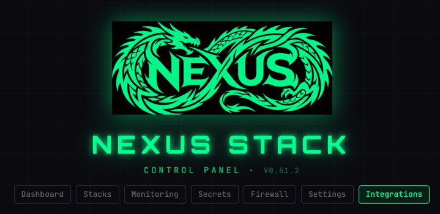
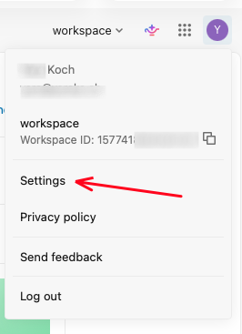
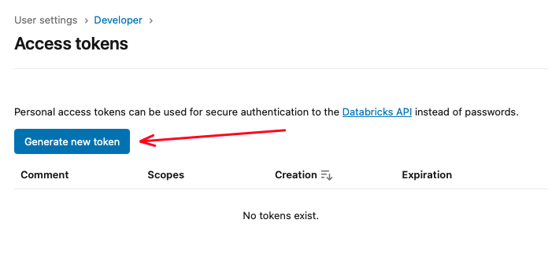
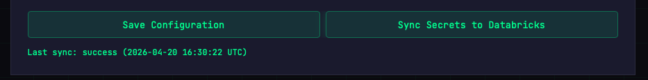
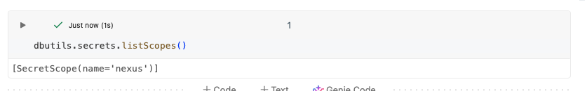
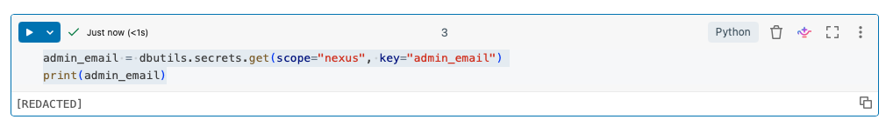

# Integrations

Integrations let your Nexus-Stack talk to platforms outside Hetzner. Today there's one first-class integration — **Databricks** — with more on the roadmap.




## Databricks

Mirrors your Infisical secrets into a Databricks workspace as secret scopes, so notebooks and jobs can read your stack's credentials without copy-pasting.

Don't have a Databricks account yet? [Register for free](https://login.databricks.com/signup).

### What gets synced

Currently only secrets are synced:

- **Secrets → Databricks secret scopes.** Every Infisical secret is mirrored into a scope named `nexus`. Re-synced on every Spin Up, or manually via **Sync Secrets to Databricks**.

### Finding your Workspace URL

Open your Databricks workspace in the browser. The URL in the address bar is your **Workspace URL** — copy everything up to `.cloud.databricks.com`.


### Creating a Personal Access Token (PAT)

Click your avatar (top right), then **Settings**.




In Settings, go to **Developer** → **Access tokens** → click **Manage**.


Click **Generate new token**.



Fill in the form:
- **Comment**: `Nexus-Stack` (or any label you recognise)
- **Lifetime**: 90 days (or longer)
- **Scope**: `Other APIs` → `all-apis`

Click **Generate**.


Copy the token immediately. You won't be able to see it again.


### Setup in the Control Plane

Go to **Integrations** in the Control Plane and fill in the two fields:

| Field | Value |
|-------|-------|
| **Workspace URL** | `https://dbc-xxxxx.cloud.databricks.com` |
| **Personal Access Token** | The token you just generated |


Click **Save Configuration**, then **Sync Secrets to Databricks**. A "Last sync: success" confirmation appears when the sync completes.



### Accessing Secrets in Databricks

Open a new Notebook in Databricks (**New → Notebook**).


List all available secret scopes — you should see `nexus`:

```python
dbutils.secrets.listScopes()
```



List all secrets in the `nexus` scope:

```python
dbutils.secrets.list("nexus")
```


Read a specific secret:

```python
admin_email = dbutils.secrets.get(scope="nexus", key="admin_email")
print(admin_email)
```



Secret values are always shown as `[REDACTED]` in Databricks notebook output — this is intentional and means the secret was read successfully.

## Future integrations

Planned: GitHub Codespaces bridge, JupyterHub SSO, Snowflake secret sync. Watch the [Nexus-Stack repo](https://github.com/stefanko-ch/Nexus-Stack) for new tiles on this page.
