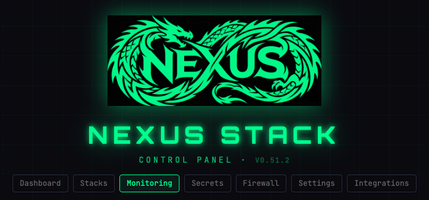
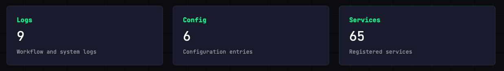
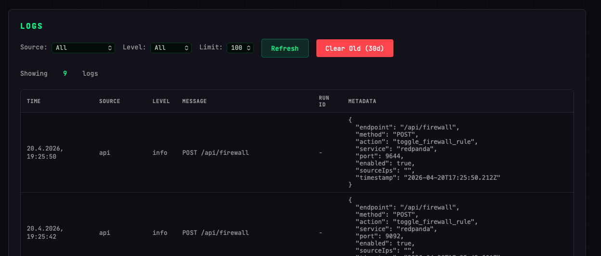
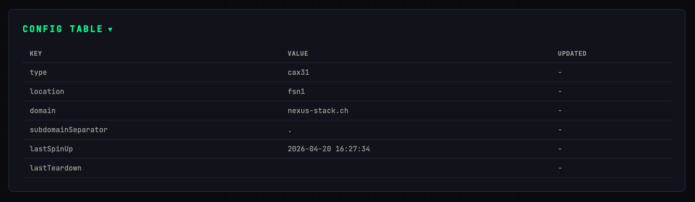
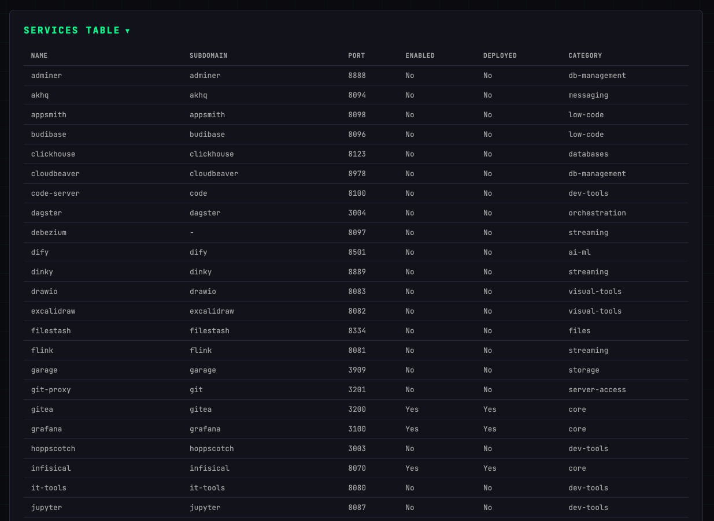

# Monitoring

The Monitoring page aggregates everything you'd look at when something isn't behaving: API logs, current configuration, and a full list of registered services with their state.

## Quick stats

Three cards at the top give you a count at a glance:

| Card | What it counts |
|------|----------------|
| **Logs** | API and system log entries |
| **Config** | Configuration entries currently applied |
| **Services** | Total registered services |

## Logs

A filterable table of all API calls and system events recorded by the Control Plane.

- **Source** — Filter by log source (e.g. `api`, `worker`)
- **Level** — Filter by severity (`info`, `warn`, `error`)
- **Limit** — How many entries to load (default 100)
- **Refresh** — Reload the log table
- **Clear Old (30d)** — Delete log entries older than 30 days

Each row shows the timestamp, source, level, message, run ID (for workflow-triggered events), and full metadata as JSON.

## Config

A read-only view of the current deployment configuration stored in D1.

| Key | Description |
|-----|-------------|
| `type` | Hetzner server model |
| `location` | Hetzner datacenter |
| `domain` | Root domain |
| `subdomainSeparator` | `.` or `-` |
| `lastSpinUp` | Timestamp of last spin-up |
| `lastTeardown` | Timestamp of last teardown |

## Services

A full table of every service registered in the stack, including its subdomain, port, enabled/deployed state, and category.

Useful for a quick overview of what's registered vs. what's actually running (**Enabled** = toggled on in D1, **Deployed** = currently running on the server).

## Typical workflows

- **A stack won't start** — check the Logs table for errors around the spin-up time
- **Domain not resolving** — check `subdomainSeparator` in Config and the service's subdomain in Services
- **Credentials missing** — verify the service shows `Deployed: Yes` in the Services table
