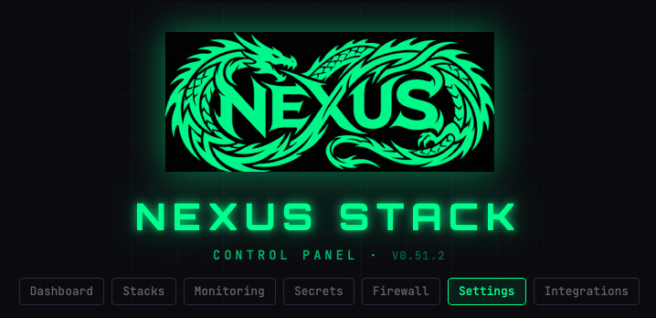
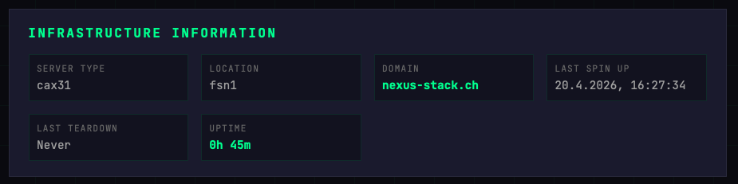
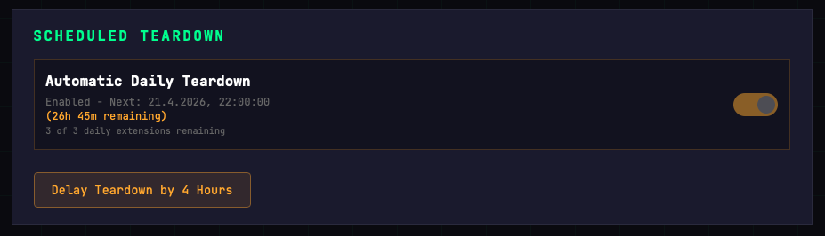
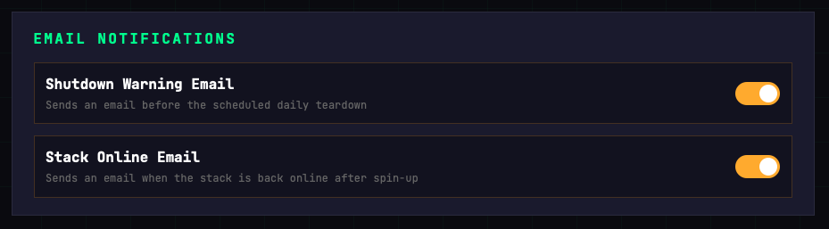

# Settings

The Settings page is split into three blocks: **Infrastructure Information** (read-only), **Scheduled Teardown**, and **Email Notifications**.

## Infrastructure Information

Read-only facts about the current deployment.

| Field | Description |
|-------|-------------|
| **Server Type** | Hetzner server model (e.g. `cax31`) |
| **Location** | Hetzner datacenter code (`fsn1`, `nbg1`, `hel1`) |
| **Domain** | Your root domain |
| **Last Spin Up** | Timestamp of the most recent spin-up |
| **Last Teardown** | Timestamp of the most recent teardown |
| **Uptime** | Time elapsed since last spin-up |

To change server type or location, edit `config.tfvars` and re-deploy — the Control Plane can't change these on the fly.

## Scheduled Teardown

The cron worker can auto-teardown your stack on a daily schedule so you don't pay for an idle server overnight.

- **Toggle** — Enable or disable the automatic daily teardown.
- **Next teardown** — Shows the scheduled time and how much time is remaining.
- **Extensions remaining** — How many times you can still delay teardown today (resets at UTC midnight).
- **Delay Teardown by 4 Hours** — Pushes the next teardown back by 4 hours. Useful when you're mid-session. Limited to 3 extensions per UTC day by default.

> If your admin has set `allow_disable_auto_shutdown = false`, the toggle is visible but locked — you can still use the delay button.

## Email Notifications

Two email notifications can be toggled independently:

- **Shutdown Warning Email** — Sent before the scheduled daily teardown as a heads-up.
- **Stack Online Email** — Sent when the stack is back online after a spin-up.

Both are sent via Resend using the API key configured during setup. If emails aren't arriving, check the Secrets page — `RESEND_API_KEY` should be under the global folder.
