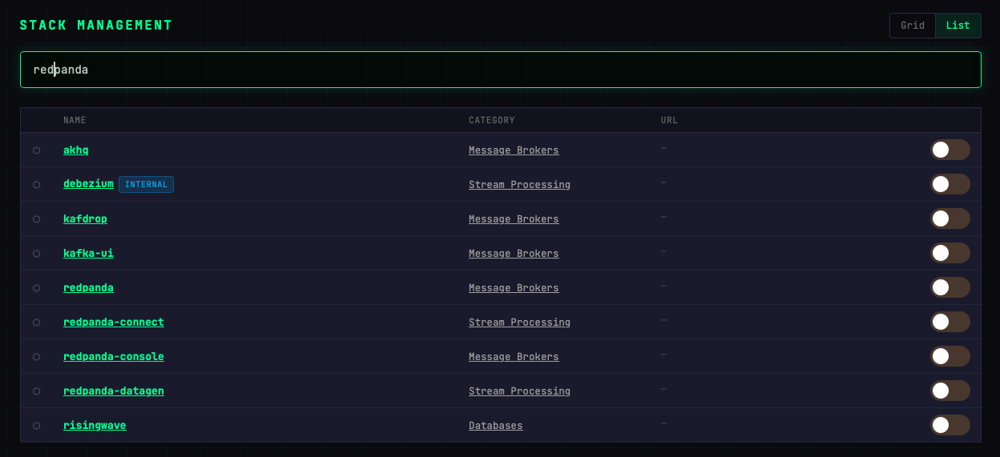

# Stacks

Your Nexus-Stack ships with 60+ Docker services grouped into categories (Data Engineering, ML/AI, Dev Tools, …). The **Stacks** page is where you turn them on, turn them off, and click through to their web UIs.

## Grid vs List

The **Grid** view (default) groups services by category. The **List** view is a flat sortable table — better for searching by name, port, or image version.

Toggle between the two with the buttons in the top right.

## Enabling and disabling a stack

Each tile has three controls:

- **Toggle** — On/Off. Enabling triggers `docker compose up -d` on the server for that stack. Disabling runs `docker compose down` and removes the container (volumes stay).
- **Open** — Opens the service's web UI in a new tab. Links to the stack's subdomain (e.g. `https://grafana.<your-domain>`).
- **Docs** — Per-stack documentation on nexus-stack.ch.

Toggling a stack takes 10–60 seconds depending on image size. The tile spins during the operation.

## Search

Press `/` (or click the search box) and type. Matches on stack name, description, and image tag. Press `Enter` to switch to the List view with the same filter applied.

## Core stacks

A small set of services are marked **core** and cannot be disabled:

- **Cloudflared** — the tunnel daemon; without it nothing is reachable
- **Infisical** — secrets store
- **Gitea** — Git server used by several integrations

These appear with a lock icon on the tile.

## What happens when you disable a stack

- The Docker container is stopped and removed
- Docker volumes with data (databases, object storage) are preserved
- DNS and Cloudflare Tunnel routes stay in place (so re-enabling is instant)
- The stack's Cloudflare Access application stays (authentication rules persist)

Re-enabling runs `docker compose up -d` against the same volume — you get your data back.
